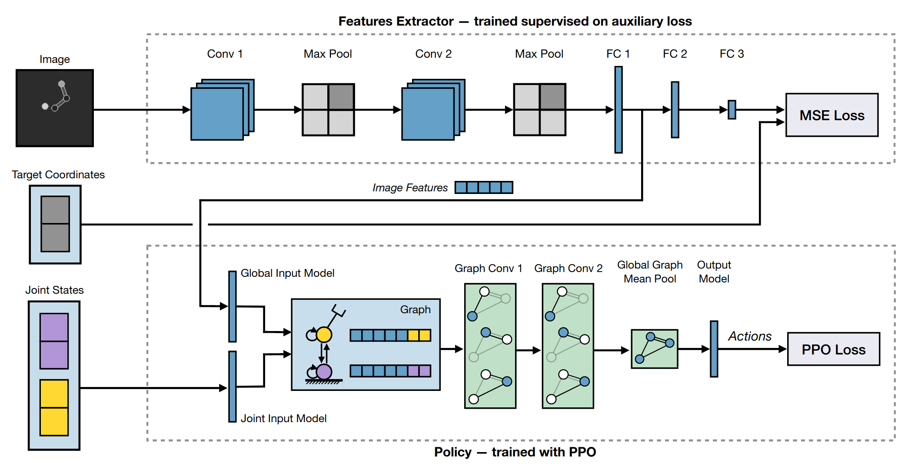

  <h1>Graph Neural Networks for Relational Inductive Bias in Vision-based Deep Reinforcement Learning of Robot Control</h1>
  <h3>Marco Oliva, Soubarna Banik*, Josip Josifovski* and Alois Knoll</h3>
  
  <h5>Technical University of Munich, Germany 
  <a href="mailto:marco.oliva@tum.de">marco.oliva@tum.de</a>,
  <a href="mailto:soubarna.banik@tum.de">soubarna.banik@tum.de</a>, 
  <a href="mailto:josip.josifovski@tum.de">josip.josifovski@tum.de</a>, 
  <a href="mailto:knoll@in.tum.de">knoll@in.tum.de</a></h5>

  <i>* These authors contributed equally to this work.</i>

> This work has been financially supported by AI4DI project, which has received funding from the ECSEL Joint Undertaking (JU) under grant agreement No 826060. The JU receives support from the European Union’s Horizon 2020 research and innovation programme and Germany, Austria, Czech Republic, Italy, Latvia, Belgium, Lithuania, France, Greece, Finland, Norway.

State-of-the-art reinforcement learning algorithms predominantly learn a policy either from a numerical state vector or from images. Both approaches generally do not take structural knowledge of the task into account. This is especially prevalent in robotic applications and can benefit learning if exploited. This work introduces a neural network architecture that combines relational inductive bias and visual feedback to learn an efficient position control policy for robotic manipulation. We derive a graph representation that models the physical structure of the manipulator and combines the robot's internal state with a low-dimensional description of the visual scene generated by an image encoding network. On this basis, a graph neural network trained with reinforcement learning predicts joint velocities to control the robot. We further introduce an asymmetric approach to train the image encoder separately from the policy using supervised learning. Experimental results demonstrate that, for a 2-DoF planar robot in a geometrically simplistic 2D environment, a learned representation of the visual scene can replace access to the explicit coordinates of the reaching target without compromising on the quality and sample efficiency of the policy. We further show the ability of the model to improve sample efficiency for a 6-DoF robot arm in a visually realistic 3D environment.

---

The paper is available as a [pre-print on arXiv](https://arxiv.org/abs/2203.05985).
The code to implement the proposed model and to reproduce the reported results is available in [this GitHub repository](https://github.com/mrcoliva/relational-inductive-bias-in-vision-based-rl).

  
  

  <i>An overview of the model architecture: the image encoder processes the image data and extracts an image feature vector which is passed through the
global input model to generate a global latent feature vector. It is trained to predict the normalized 2D reaching target coordinates in the image space. The
robot’s joint states are individually passed through the joint input model to produce a latent feature vector for each joint. From these latent features, a graph
representing the current state of the robot and the environment is constructed. The policy graph network learns a control policy mapping from the graph to
an n-dimensional action vector of angular joint velocity commands.</i>
  

### Motivation
Most research in the field of reinforcement learning focuses on learning behaviors in environments whose properties, dynamics, and reward landscapes are initially unknown, requiring agents to learn completely from scratch. For many real-work tasks, this requires large amounts of interactions with the environment, making learning inefficient — especially when the control of actual hardware is involved. A different perspective of describing an environment is through entities and their relations. Typically, an agent receives the state of the environment as a flat numerical vector which may include information about objects in the environment but generally does not encode their relations or their importance to the task at hand. This forces the agent to discover such information by thorough exploration during its interactions with the environment. When applying learning algorithms to robotic control applications, however, there exist clear structural relations that remain constant throughout the task and can be explicitly modeled by inducing structural priors into the system. Acknowledging that the robot’s structure — a kinematic chain of actuated joints interconnected by links — can naturally be modeled as a discrete graph, in which nodes represent joints and edges represent links. This allows the application of graph neural networks that directly operate on structural data and exploit the inherent spatial relationships. 
 
In many real-world settings, structural information is not readily available, and visual feedback serves as a mechanism to estimate the environment’s state and plan actions. In recent years, many reinforcement learning methods were proposed for image-based settings where a policy is derived from pixel values of the rendered environment and a reward signal. The growing interest in optimizing control policies from visual feedback is in part motivated by the desire to make the learning methodology more similar to the way that humans learn, i.e. by relying less on exact numerical values and more on vision and combinatorial reasoning. The computational model of graph neural networks that propa- gates information over relationships introduces this aspect of combinatorial knowledge. Also, in humans, visual feedback alone is insufficient for precise motion. It is well-established that proprioceptive feedback — the biological pendant to feedback from joint sensors in robots — plays a crucial role in human motor control and that decreasing the quality or entirely depriving a human of proprioceptive sensory information leads to a significant reduction in motor control precision. Combined with the fact that the vast majority of robots are equipped with highly accurate joint angle and velocity sensors, this motivates extending image-based robotic learning systems to incorporate joint feedback and known kinematic relations. We identify a blind spot in the reinforcement learning research as, to our knowledge, there exists no method for induc- ing a relational bias into a vision-based reinforcement learning system. For this reason, we explore and present a graph neural network model that integrates structural knowledge with image observations and apply it to learn an efficient position control policy for robotic manipulation using reinforcement learning. 

### Contributions
1. We introduce a new architecture that combines an image encoding network with a lightweight graph network to learn an efficient control policy. 
2. We show that the relational inductive bias introduced by applying a graph neural network to the graph rep- resentation of the robot’s state can reduce the sample complexity when training RL agents for robot control without compromising quality. 
3. We present a method to iteratively train an image en- coding network for image representation learning based on optimizing an auxiliary loss from data generated by the policy.
